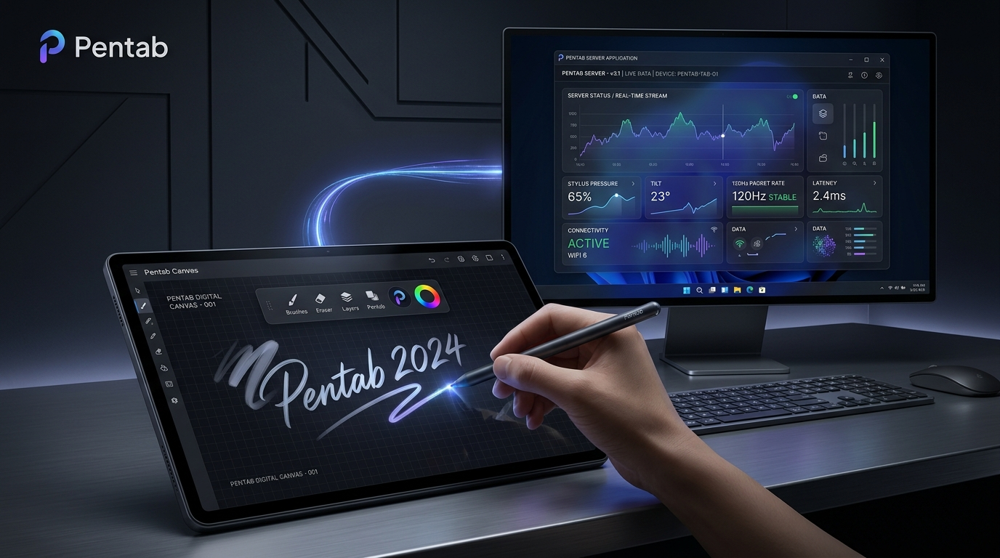
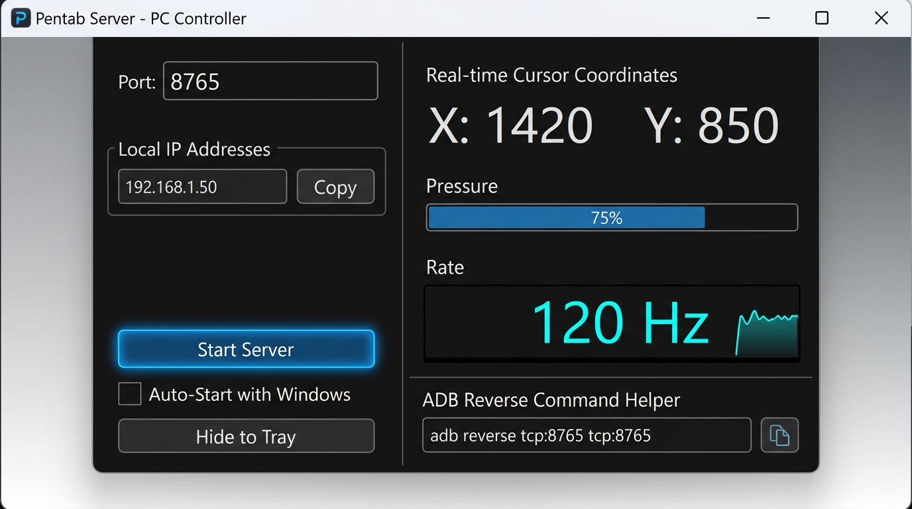

# Pentab Server (PC側 サーバー)

<div align="center">

[](LICENSE)
[-0078D6.svg)](https://microsoft.com/windows)
[](https://dotnet.microsoft.com)

**Android タブレットのタッチ・スタイラス入力を Windows マウス/ペン操作へ変換する超軽量・高精度常駐サーバー**

[English](README.md) | **[日本語](README.ja.md)** | [简体中文](README.zh.md)

[Android クライアント (Pentab)](https://github.com/SSZcreate/Pentab) | [リリースページ](https://github.com/SSZcreate/Pentab_server/releases) | [技術仕様書 (docs)](docs/01_system_architecture.md)

</div>

---

<div align="center">
  
</div>

---

## 🌟 主な特徴

- ⚡ **超高速・軽量な単一バイナリ**: 外部ランタイム不要のスタンドアロン単一 `.exe`（Self-Contained Single File）。
- 🖱️ **低遅延 Win32 Direct Input Injection**: `user32.dll` の `SendInput` API をダイレクトに呼び出し、OS ネイティブの低遅延なマウス/ペン操作を実現。
- 📊 **リアルタイム・モニタリング**:
  - 受信パケットレート（Hz / EPS）のリアルタイム計測表示
  - カーソル絶対座標（X, Y）、筆圧（Pressure）、入力モードのモニタリング
- 📥 **システムトレイ（通知領域）常駐 & 自動起動**:
  - Windows 起動時の自動起動（Auto-Start レジストリ登録）対応
  - 起動時にトレイへ直接最小化するバックグラウンド常駐モード
  - タスクトレイアイコンの右クリックメニュー / ダブルクリックで瞬時にウィンドウ表示
- 🌐 **多言語対応 (i18n)**:
  - 英語 (English)、日本語、簡体字中国語 (简体中文) のワンクリック切り替え
- 🔌 **ADB 有線 & Wi-Fi ワイヤレス対応**:
  - USB 有線接続時は `adb reverse` でポートフォワーディング
  - ローカル IP アドレスを UI 上に自動検知・ワンクリックコピー可能
- 🖥️ **マルチモニター & アスペクト比補正**:
  - プライマリディスプレイおよびマルチモニター環境に対応
  - タブレットと PC 画面のアスペクト比自動マッピング

---

## 📸 アプリケーション画面

<div align="center">
  
  <p><em>Pentab Server メインウィンドウ（リアルタイム座標・筆圧・Hzモニタリング）</em></p>
</div>

---

## 🚀 クイックスタート

### 1. ダウンロード
[Releases](https://github.com/SSZcreate/Pentab_server/releases) から最新の `PentabServer-v1.0.0-win-x64.zip` をダウンロードし、任意のフォルダに解凍します。

### 2. サーバーの起動
1. `PentabServer.exe` を実行します。
2. 初回起動時に Windows Defender / ファイアウォールの警告が表示された場合は、「プライベートネットワーク」へのアクセスを許可してください。

### 3. タブレットからの接続

#### A. USB 接続（推奨・超低遅延）
1. タブレットを USB 接続し、コマンドプロンプトまたは PowerShell で以下を実行します：
   ```bash
   adb reverse tcp:8765 tcp:8765
   ```
2. タブレット側で `127.0.0.1:8765` のまま Connect をタップします。

#### B. Wi-Fi 接続（ワイヤレス）
1. PC 画面上に表示されているローカル IP アドレス（例: `192.168.1.xxx`）の「Copy」ボタンを押します。
2. タブレット側のホスト欄に入力して Connect をタップします。

---

## ⚙️ システム設定・常駐機能

| 設定項目 | 説明 |
| :--- | :--- |
| **Windows 起動時に自動起動 (Auto-Start)** | チェックを入れると、PC 起動時に自動で PentabServer がバックグラウンド起動します。 |
| **起動時にトレイへ最小化 (Start in Tray)** | 起動時にウィンドウを表示せず、タスクトレイ（インジケーター）に直接格納します。 |
| **Hide to Tray [📥]** | ウィンドウをトレイに最小化します。トレイアイコンのダブルクリックで復帰します。 |
| **表示言語 (Language)** | English / 日本語 / 简体中文 をリアルタイム切り替え。 |

---

## 🛠️ 開発・ビルド方法

### 必要要件
- Windows 10 / 11 (x64)
- .NET 8.0 SDK

### ビルド手順
```bash
# リポジトリのクローン
git clone https://github.com/SSZcreate/Pentab_server.git
cd Pentab_server

# デバッグ実行
dotnet run

# スタンドアロン単一バイナリ (exe) の発行
dotnet publish -c Release -r win-x64 --self-contained true -p:PublishSingleFile=true -o ./publish
```

---

## 📄 ドキュメント

- [システムアーキテクチャ設計書](docs/01_system_architecture.md)
- [通信プロトコル仕様書 (WebSocket JSON)](docs/02_protocol_specification.md)
- [Android クライアント実装仕様書](docs/03_android_client_specification.md)
- [PC サーバー実装仕様書](docs/04_pc_server_specification.md)
- [ビルド・デプロイガイド](docs/05_build_and_deployment_guide.md)

---

## 📜 ライセンス

本プロジェクトは [MIT License](LICENSE) の下で公開されています。
